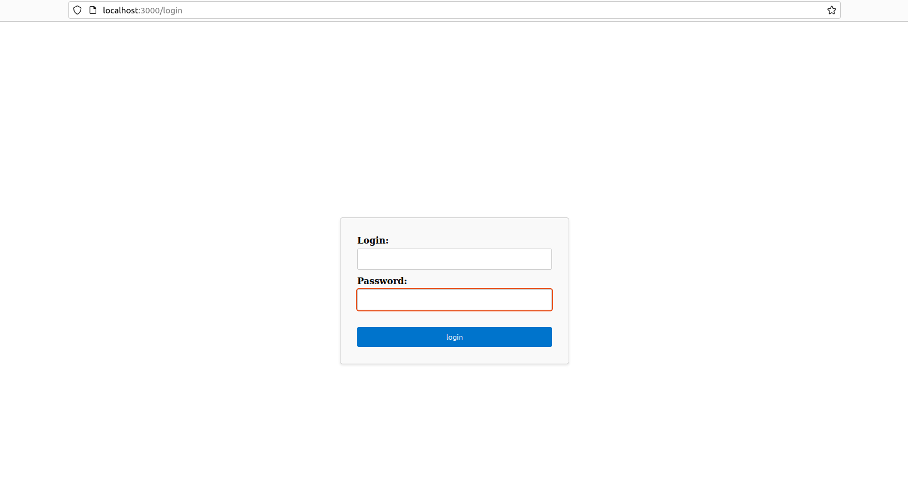

# QR Server
Веб-приложение, предназначенное для кодирования и декодирования информации.

Рабочий стенд для проверки сканирования: 


## Установка

1. Убедитесь, что у вас установлены **Java Development Kit (JDK)** и **Leiningen**. Если они не установлены, следуйте инструкциям на официальных веб-сайтах для их установки.

2. Склонируйте репозиторий с сервером на свой компьютер:

```
git clone https://github.com/Untouchabl3Pineapple/clojureQrServer.git
```

3. Перейдите в каталог проекта:

```
cd clojureQrServer/QR-Server
```

4. Перекомпилируйте ClojureScript в JavaScript:

```
lein cljsbuild once cljs
```

5. Запустите сервер с помощью команды:

```
lein run
```


## Использование

Для **использования сканера** с мобильного устройства **необходимо** **подключить протокол HTTPS**, так как функция `getUserMedia` из JavaScript **не работает с HTTP протоколом**.

После успешного запуска сервера вы сможете использовать его для кодирования и декодирования QR-кодов.

### Авторизация

Чтобы пройти авторизацию, необходимо перейти на страницу /login.
Пример авторизации:




Пример попытки авторизации с неверными данными:


### Кодирование строки в QR-код

Чтобы закодировать строку в QR-код, перейдите на страницу /qrgenerator и в поле *Input message to encode* введите строку, которую вы хотите закодировать. Например:


В ответе вы получите изображение QR-кода в формате PNG:


### Декодирование QR-кода в строку

Чтобы декодировать QR-код в строку, перейдите на страницу /scanner, и в открывшееся окно с камерой наведите изображение содержащие QR-код:


В ответе вы получите декодированную строку.

### Лог данные

Для получения лог данных необходимо перейти на страницу /logger. В результате будут отображены лог данные, а именно: id операции, время операции, оперируемые данные.

Для получения log данных необходимо иметь права администратора.

Пример логгера:


Пример попытки доступа к логгеру с неподходящим токеном:


## Реализация

### Точка входа в программу (core.clj)

```
(def app
  (-> routes/app-routes
      (wrap-defaults site-defaults)
      (wrap-reload {:dirs ["src"]})))


(defn -main []
  (let [port 3000]
    (jetty/run-jetty app {:port port})))
```

В данном фрагменте кода представлен функция main, которая запускает веб-сервер на порте 3000 для обслуживания обработчика app. 
### Маршруты (routes.clj)

```
(defroutes app-routes
  (GET "/home" [] handlers/home-handler)

  (GET "/scanner" [] (pages/scanner-page))
  (GET "/logger" [] handlers/logger-handler)
  (POST "/log" [qrData] (db/insert-log qrData))

  (GET "/qrgenerator" [] (pages/qr-page))
  (POST "/qrgenerator" [text] (handlers/qr-generator text))
  
  (GET "/login" [] handlers/login-handler)
  (GET "/logout" [] handlers/logout-handler)
  (POST "/login" [] cas/cas-auth))
```
В данном фрагменте кода представлен обработчик последовательности машртрутов. 
Маршрут описан следующим образом: 
* http-метод 
* маршрут 
* аргументы для функции-обработчика
* функция обработчик 
### Функции-обработчики (handlers.clj)

```
(defn logger-handler [req]
    ...
)


(defn qr-generator [text]
    ...
)


(defn home-handler [request]
    ...
)


(defn login-handler [request]
    ...  
)


(defn logout-handler [request]
  
)
```
В данном фрагменте кода представлены функции-обработчики машртрутов.


### CAS авторизация (auth.clj)

```

(defn verify-token [token]
    ...
)

(defn verify-admin-token [token] 
    ...
)

(defn- generate-token [login]
)

(defn- admin-login-validation [login password]
    ...
)

(defn- user-login-validation [login password]
    ...
)

(defn- login-validation [login password]
    ...
)

(defn- authentication [login password]
    ...
)

(defn cas-auth [request]
    ...
)
```
В данном фрагменте кода представлена реализация cas авторизации. 
При попытке авторизации введенные пользователем данные передаются функции cas-auth.
cas-auth передает данные функции, которая генерирует специальный токен.
Далее токен возвращается и проверяется его валидность. 
В случае валидности токена пользователь получает доступ к системе.

### Взаимодействие с базой данных (db.clj)

```
(def db-params
)

(defn get-connection []
)

(defn get-all-logs [db]
)

(defn insert-log [data]
)
```
В качестве СУБД была выбрана postgres.
База данных используется для хранения логов, предоставляющих следующую информацию: id, время выполнения операции, оперируемая строка.

### Страницы (pages.clj)
```
(defn render-page [title content]
    ...
)


(defn scanner-page []
    ...
)


(defn logger-page [logs]
    ...
)


(defn qr-generator-page [unique-filename text]
    ...
)


(defn qr-page []
    ...
)


(defn home-page []
    ...
)


(defn layout [content]
    ...
)
```

В данном фрагменте кода предоставлены html-страницы.

### Используемые библиотеки

Были использованы следующие библиотеки:

* hiccup.core - рендеринг дерева векторов в строку HTML.
* ring.util.anti-forgery - служебные функции для вставки токенов защиты от подделки в HTML-формы.
* next.jdbc - обертка Clojure низкого уровня для доступа к базам данных на основе JDBC
* com.nopolabs.clozxing.encode - функции, реализующие кодирование и декодирование QR-кодов
* clojure.java.io - полиморфные служебные функции ввода-вывода для Clojure
* ring.util.response - функции для создания и дополнения response maps.
* compojure.core - функции и макросы для построения маршрутов и их объединения в более сложные функции
* ring.adapter.jetty - адаптер Ring, использующий встроенный веб-сервер Jetty 9. Адаптеры используются для преобразования обработчиков Ring в работающие веб-серверы.
* ring.middleware.defaults - функции для предоставления обработчику значений по умолчанию.
* ring.middleware.reload - функции, которые перезагружают измененные пространства имен при каждом запросе.
